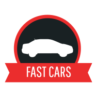

<h1 align="center">
  
</h1>

<p align="center">Página de Venda de Automóveis.</p>

<p align="center">
  
  <a href="https://opensource.org/licenses/MIT">
    
  </a>
  <a href="https://github.com/martins-rafael/lorem-ipsum-veiculos/commits/master">
    
  </a>
</p>

<br>

<p align="center">
  
</p>

## :red_car: Sobre

Versão personalizada do projeto #5 desenvolvido no curso Front-End da Danki Code, com o intuito de exercitar o conteúdo aprendido. Além do front-end que foi lecionado no curso, adicionei o back-end da página utilizando NodeJS.

<p align="center">
  
</p>

<br>

## :computer: Tecnologias
- [HTML](https://devdocs.io/html/)
- [CSS](https://devdocs.io/css/)
- [Javascript](https://devdocs.io/javascript/)
- [JQuery](https://jquery.com/)
- [Node](https://nodejs.org/en/)
- [Express](https://expressjs.com/)
- [Nunjucks](https://mozilla.github.io/nunjucks/)

<br>

## :wrench: Instalação e uso

Para rodar a aplicação, você precisa instalar o [Node](https://nodejs.org/en/).

Siga os passos abaixo:

```bash
# Abra um terminal e copie este repositório com o comando
$ git clone https://github.com/martins-rafael/lorem-ipsum-veiculos.git
# ou use a opção de download.

# Entre na pasta 
$ cd lorem-ipsum-veiculos

# Instale as dependências
$ npm install

# Rode a aplicação
$ npm start

# Acesse http://localhost:3000 no seu navagador.
```

<br>

## :memo: Licença


Esse projeto está sob a licença MIT. Veja o arquivo [LICENSE](/LICENSE) para mais detalhes.
