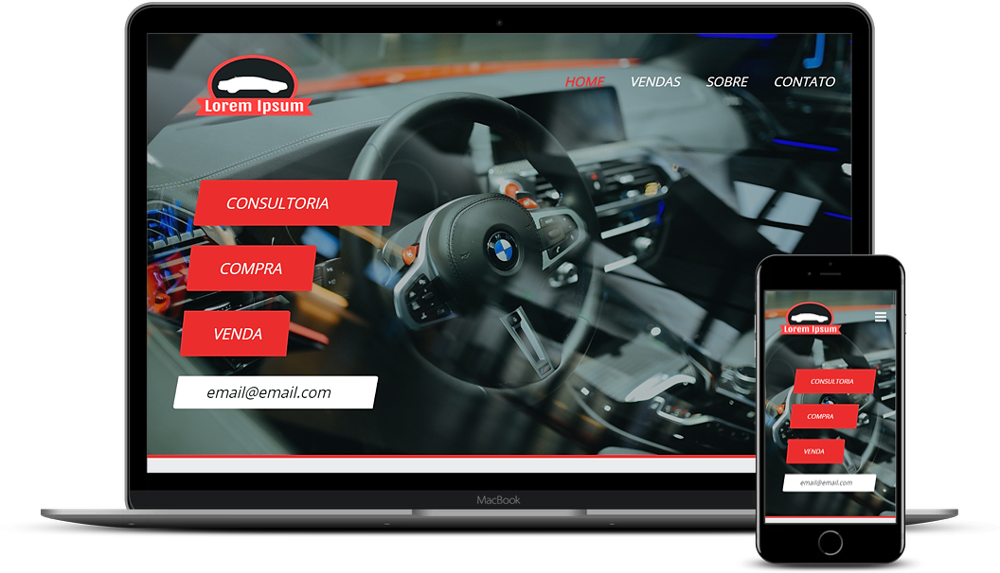

<h1 align="center">
  
</h1>

Página de Venda de Automóveis.

  
  
  
  

 

  

## :red_car: Sobre

Versão personalizada do projeto 05 desenvolvido no curso Front-End da Danki Code, com o intuito de exercitar o conteúdo aprendido.

## :computer: Tecnologias
- [HTML](https://devdocs.io/html/)
- [CSS](https://devdocs.io/css/)
- [Responsive Web Design](https://www.w3schools.com/html/html_responsive.asp)
- [Javascript](https://devdocs.io/javascript/)
- [JQuery](https://jquery.com/)

## :memo: Licença

Esse projeto está sob a licença MIT. Veja o arquivo [LICENSE](/LICENSE) para mais detalhes.
